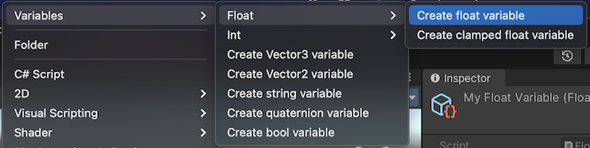

# Unity Variables
Unity3d variables allowing the sharing of data between different game elements through ScriptableObjects.

This project is inspired on the [presentation](https://youtu.be/raQ3iHhE_Kk?t=926) by [Ryan Hipple](https://twitter.com/roboryantron).
I added my own flair to it by adding simple property drawers and extendability for custom and complex variables.

Feedback is welcome.

## Plug and Play
1. Open "Package Manager"
2. Choose "Add package from git URL..."
3. Use the HTTPS URL of this repository:
   `https://github.com/yanicksenn/unity-variables.git`
4. Click "Add"

## Usage
- [References](#user-content-references)
- [Variables](#user-content-variables)
- [Customization](#user-content-customization)

### References
This package provides you references and variables.
References are used in the scripts to allow access to a constant or variable.

These are the build-in references and the corresponding variables:

| Reference             | Variable               |
|-----------------------|------------------------|
| `FloatReference`      | `FloatVariable`        |
| `"`                   | `ClampedFloatVariable` |
| `IntReference`        | `IntVariable`          |
| `"`                   | `ClampedIntVariable`   |
| `BoolReference`       | `BoolVariable`         |
| `StringReference`     | `StringVariable`       |
| `Vector2Reference`    | `Vector2Variable`      |
| `Vector3Reference`    | `Vector3Variable`      |
| `QuaternionReference` | `QuaternionVariable`   |

Nobody hinders you from directly using variables inside of your scripts.
Please keep in mind then the interchangeability of constant and variable is not possible.

You can use them inside of your scripts. You don't need to call the constructor but if you do you can provide a default value for your constant.

```c#
public class MyBehaviour : MonoBehaviour
{
    public FloatReference myFloat;
    // public FloatReference myFloat = new FloatReference(7.2f);
}
```

The button  is drawn in front you your reference.


If you click on it, a popup with be displayed providing you with the options of using the variable or a the constant.


After choosing the variable the property will immediately be updated to allow referencing a variable. Vice versa if you choose to use the constant.


You can read and write to your references through the `myFloat.Value` property.

Adding the `Start` method to the behaviour ... 
```c#
void Start() {
   myFloat.Value = 99.876f;
   Debug.Log(myFloat.Value);
}
```

... will result in the following console output.


### Variables
Variables can be created through the asset menu > Create > Variables > ... .



After assigning the created variable to the behaviour you should see a preview with value of the variable.


### Customization
It is possible to create you own reference and variable by extending from `AbstractReference` and `AbstractVariable`.
Mostly you will just have to create boilerplate code.

#### Data
Start by defining a data class. It is important that this `class` or `struct` is annotated with `Serializable`.
```c#

// Arbitrary data object 
[Serializable]
 public struct Character
 {
     public string name;
     public int age;
     public float height;
     public BoolReference alive;
     public Pet pet;
 }
 
 // Arbitrary example of a nested object
 [Serializable]
 public class Pet
 {
     public string name;
     public int age;
     public BoolReference alive;
 }
```

#### Event (Boilerplate)
Create an event with the type of the data class as payload. This is just boilerplate code.
```c#
[Serializable]
public class CharacterEvent : UnityEvent<Character> { }
```

#### Variable (Boilerplate)
Create a variable class by extending from `AbstractVariable` (inherits from `ScriptableObject`). This is just boilerplate code.
```c#
[CreateAssetMenu(
     menuName = Variables.RootMenu + "/Create Character variable",
     fileName = "Character")]
public class CharacterVariable : AbstractVariable<Character, CharacterEvent> { }
```

#### Reference (Boilerplate)
Create a reference class by extending from `AbstractReference`. This is just boilerplate code. It is possible to provide a default constant value inside of the constructor.
```c#
[Serializable]
public class CharacterReference : AbstractReference<Character, CharacterVariable, CharacterEvent>
{
    public CharacterReference(Character defaultConstantValue) : base(defaultConstantValue) { }
}
```

#### Drawer (Boilerplate)
Create a drawer class by extending from `AbstractSimpleReferenceDrawer`. This is just boilerplate code.
```c#
[CustomPropertyDrawer(typeof(CharacterReference))]
public class CharacterReferenceDrawer : AbstractSimpleReferenceDrawer { }
```

#### Example
Use the new `CharacterReference` inside of your `MonoBehvaiour` or `ScriptableObject`.
```c#
public class CharacterBehaviour : MonoBehaviour {
    public CharacterReference character;
}
```

#### Example in inspector

Using the `CharacterBehaviour` on a `GameObject` would then show the following editor in the inspector, allowing you to edit the underlying constant.


Or if you want to reference a variable.


